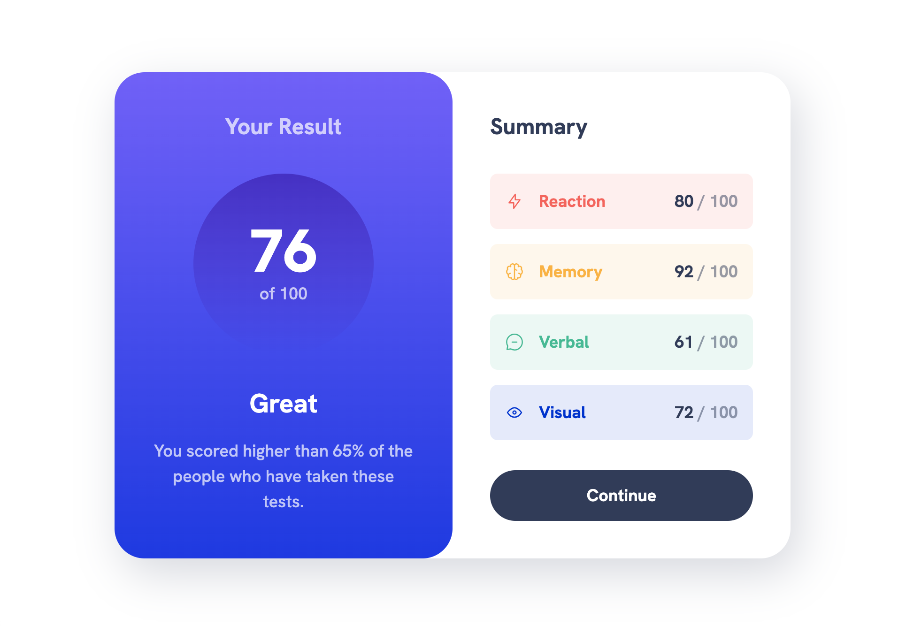

# Frontend Mentor - Results summary component solution

This is a solution to the [Results summary component challenge on Frontend Mentor](https://www.frontendmentor.io/challenges/results-summary-component-CE_K6s0maV). Frontend Mentor challenges help you improve your coding skills by building realistic projects. 

## Table of contents

- [Overview](#overview)
  - [The challenge](#the-challenge)
  - [Screenshot](#screenshot)
  - [Links](#links)
- [My process](#my-process)
  - [Built with](#built-with)
  - [What I learned](#what-i-learned)
    - [Starter template development](#starter-template-development)
    - [Adapting the template](#adapting-the-template)
    - [CSS methodology](#css-methodology)
    - [Some advanced SCSS](#some-advanced-scss)
    - [Deploying with GitHub pages](#deploying-with-github-pages)
  - [Continued development](#continued-development)
  - [Useful resources](#useful-resources)
- [Author](#author)
- [Acknowledgments](#acknowledgments)

**Note: Delete this note and update the table of contents based on what sections you keep.**

## Overview

### The challenge

Users should be able to:

- View the optimal layout for the interface depending on their device's screen size
- See hover and focus states for all interactive elements on the page

### Screenshot



### Links

- Solution URL: [GitHub repository](https://github.com/brianetoon/results-summary-component/tree/master)
- Live Site URL: [View live on GitHub Pages](https://brianetoon.github.io/results-summary-component/)

## My process

### Built with

- [Vite](https://vitejs.dev/) - Frontend tooling
- [React](https://reactjs.org/) - JS library
- [Sass](https://sass-lang.com/) - CSS pre-processor
- [CUBE CSS](https://cube.fyi/) - CSS Methodology

### What I learned

I recently completed Kevin Powell's [Beyond CSS](https://www.beyondcss.dev/) course that involves creating this [starter template](https://github.com/brianetoon/sass-starter-template/tree/master) which leverages the power of Sass and serves as an efficient starting point for my web projects. I decided that this challenge would be a fun way to utilize my template and put my new skills to the test on my own. Here's what I've learned from this hands-on experience:

#### Starter template development

Creating and refining this Sass starter template has taught me a way of setting up an organized project structure. I've learned how to create a foundation that simplifies the initiation of new web projects while ensuring consistency in the code architecture and styling.

The template stucture is very similar to the popular [7-1 Pattern](https://sass-guidelin.es/#the-7-1-pattern) where you have [partials](https://sass-lang.com/guide/#partials) that each belong in a specific folder depending on that file's purpose. Below is a quick breakdown of how the template is structured and how it works.

The structure for the template I created and used for this challenge looks alot like this:
```
sass/
|
|-abstracts/
|  |- _breakpoints.scss
|  |- _colors.scss
|  |- _fuctions.scss
|  |- _mixins.scss
|  |- _sizes.scss
|  |- _typography.scss
|  |- _index.scss
|
|-base/
|  |- _root.scss
|  |- _reset.scss
|  |- _general.scss
|  |- _index.scss
|
|-components/
|  |- _cards.scss
|  |- _buttons.scss
|  |- _navigation.scss
|  |- _index.scss
|
|-layout/
|  |- _even-columns.scss
|  |- _grid-auto-fit.scss
|  |- _index.scss
|
|-utilities/
|  |- _colors.scss
|  |- _container.scss
|  |- _flow.scss
|  |- _font-families.scss
|  |- _font-sizes.scss
|  |- _font-weights.scss
|  |- _spacing.scss
|  |- _index.scss
|
|-vendor/
|  |- _prism.scss
|  |- _index.scss
|
|- main.scss
```

Within each folder is an _index.scss file that forwards each partial in it's folder so that it is available for use in other files. For example:

```scss
// /sass/abstracts/_index.scss

@forward "breakpoints";
@forward "colors";
@forward "functions";
@forward "mixins";
@forward "sizes";
@forward "typography";
```

Finally, the main.scss file brings in all of the contents of each folder (with the exception of the abstracts folder). The main.scss file is what ultimately gets compiled into the CSS that is sent to the browser. 

```scss
// /sass/main.scss

@use "base";
@use "components";
@use "layout";
@use "utilities";
@use "vendor";
```

This [video](https://www.youtube.com/watch?v=CR-a8upNjJ0) from Kevin Powell provides a great explanation if you're interested in learning more about how this works.

#### Adapting the template

With this foundation in place, the next step is to update some files in the template using the design specifications of the project. To start, I created a $colors map inside my _colors.scss file using the colors provided by the style-guide.md file.

```scss
// /sass/abstracts/_colors.scss

$colors: (
  neutral: (
    '700': hsl(224, 30%, 27%),
    '300': hsl(241, 100%, 89%),
    '200': hsl(221, 100%, 96%),
    '100': hsl(0, 0%, 100%),
  ),
  primary: (
    '400': hsl(252, 100%, 67%),
    '500': hsla(256, 72%, 46%, 1),
  ),
  secondary: (
    '400': hsl(241, 81%, 54%),
    '500': hsla(241, 72%, 46%, 0),
  ),
  accent: (
    '1': hsl(0, 100%, 67%),
    '2': hsl(39, 100%, 56%),
    '3': hsl(166, 100%, 37%),
    '4': hsl(234, 85%, 45%),
  ),
);
```

Next, I updated my _typography.scss file using the information provided by the style-guide.md file.

```scss
// /sass/abstracts/_typography.scss

$ff-sans: 'HankenGrotesk', system-ui, sans-serif;
$ff-serif: serif;

$ff-base: $ff-sans;
$ff-accent: $ff-serif;

$font-sizes: (
  '400': 1.125rem,
  '500': 1.25rem,
  '600': 1.5rem,
  '700': 1.75rem,
  '800': 2rem,
  '900': 4rem,
);

$fw-500: 500;
$fw-700: 700;
$fw-800: 800;
```

#### CSS methodology

After having everything set up and ready to go, I had to decide how I was going to actually apply styles to elements. In this project I utilized concepts from Andy Bell's [CUBE CSS](https://cube.fyi/). 

> "CUBE CSS is a CSS methodology that’s orientated towards simplicity, pragmatism and consistency. It’s designed to work with the medium that you’re working in—often the browser—rather than against it."

You may be wondering what a CSS methodology even is. To me it's a way of thinking or an approach to how you go about applying styles in a given project. CUBE stands for Composition Utility Block Exception. You start by applying composition (layout) styles followed by utility styles then finally blocks (components) and exceptions.

Here is an example of CUBE CSS being applied to one of the components in this project:

```js
// /components/SummaryItem.jsx

const SummaryItem = ({ item }) => {

  return (
    <li className="summary-item | fw-bold" data-item-type={item.type}>

      <div className="flex-group">
        
        <h3 className="summary-item-title">
          { item.title }
        </h3>
      </div>

      <p className="summary-score">
        <span className="clr-neutral-700">{ item.score }</span> / 100
      </p>

    </li>
  );
}
```
Looking at the classes being applied to the ```<li>``` tag "summary-item" is the block class and "fw-bold" is a utility class. Classes in CUBE CSS are separated with a pipe or even using brackets as a means of organization and clarity. The data attribute "data-item-type" is the exception and is applying an accent color to the element (more on that in the next section). For more information on how CUBE CSS works check out the link above to the documentation.

#### Some advanced SCSS

Within my $colors map, there is a nested map of accent colors.

```scss
$colors: (
  // other color maps

  accent: (
    '1': hsl(0, 100%, 67%),
    '2': hsl(39, 100%, 56%),
    '3': hsl(166, 100%, 37%),
    '4': hsl(234, 85%, 45%),
  ),
);
```

I needed to apply one of these unique colors to each list item in the summary component. 

According to the SASS docs:
> The @each rule makes it easy to emit styles or evaluate code for each element of a list or each pair in a map. It’s great for repetitive styles that only have a few variations between them.

So I decided that using the @each rule would be a good way to do this. I then created a new summary-item partial that uses the @each rule to iterate through each color in the accent map. This generates the selectors to apply the desired accent color to the title of each list item as well as the accent background color reducing the opacity with the rgba function.

```scss
// /sass/components/_summary-item.scss

@use "sass:map";
@use "../abstracts/" as *;

@each $key, $value in map.get($colors, accent) {
  .summary-item[data-item-type="accent-#{$key}"] {
    padding: size('16');
    border-radius: size('8');
    background-color: rgba($value, 0.1);
    display: flex;
    justify-content: space-between;

    & .summary-item-title {
      color: $value;
    }

    & .summary-score {
      color: rgba(clr(neutral, '700'), 0.5);
    }
  }
}
```

#### Deploying with GitHub pages

The Vite docs include a [guide](https://vitejs.dev/guide/static-deploy.html) to deploying a static site. Because I already have a remote repository for this project on GitHub, using GitHub pages seemed like a great option to deploy this project.

Here are the steps I took to get my project deployed:

1. Install the gh-pages package into the project

   ```npm install gh-pages -D```

2. Add the base directory to vite.config.js 

   ```js
    import { defineConfig } from 'vite'
    import react from '@vitejs/plugin-react'

    export default defineConfig({
      base: "/results-summary-component/",
      plugins: [react()],
    })
   ```

3. Update package.json 
    
    Add homepage URL:
    ```json
    {
      "homepage": "https://brianetoon.github.io/results-summary-component/",
      "name": "results-summary-component",
      "private": true,
      "version": "0.0.0",
      "type": "module",
      "scripts": {
        <!-- scripts -->
      },
      "dependencies": {
        <!-- dependencies -->
      },
      "devDependencies": {
        <!-- devDependencies -->
      }
    }
    ```
    
    Add predeploy and deploy scripts:
    ```json
    {
      "homepage": "https://brianetoon.github.io/results-summary-component/",
      "name": "results-summary-component",
      "private": true,
      "version": "0.0.0",
      "type": "module",
      "scripts": {
        "predeploy": "npm run build",
        "deploy": "gh-pages -d dist",

        <!-- other scripts -->
      },
      "dependencies": {
        <!-- dependencies -->
      },
      "devDependencies": {
        <!-- devDependencies -->
      }
    }
    ```

4. Run the deploy command
    
    ```npm run deploy```

5. View the live project 
    
    Go to your GitHub repository, click on "Settings" and then click on "Pages". Once the deployment completes you will see "Your site is live at" followed by the URL of your live site. 

You can view my live project [here](http://localhost:5174/results-summary-component/).

### Continued development

Utilizing my starter template proved to be an invaluable asset throughout the course of this coding challenge. It provided a strong foundation for the project, enabling me to jumpstart the styling and development process. However, I don't view it as a static resource but more of a dynamic tool that I plan to enhance continually as I gain new skills and refine my workflow.

The CUBE CSS methodology also played an important role in this project, allowing me to approach styling with a systematic and organized mindset. It's not just a one-off technique but a philosophy I intend to carry forward. The principles of Composition, Utility, Block, and Exception (CUBE) have proven effective in ensuring a consistent and scalable design system. My goal is to delve deeper into its application, especially in the context of larger projects. I'll be focusing on improving the composition layer on my future projects.

One of my most valuable takeaways from completing this challenge was the practice of reflection. Taking the time to assess my process, what worked well, and areas where I can improve is a habit I intend to continue. Each project is a new opportunity to learn, adapt and refine my skills and taking some time for reflection is an important step in the growth and learning process.


### Useful resources

- [Sass Documentation](https://sass-lang.com/) - Having the Sass docs readily available was helpful while completing this project.
- [CUBE CSS](https://cube.fyi/) - Ditto for the CUBE CSS docs
- [Beyond CSS](https://www.beyondcss.dev/) - Referencing the course material from Kevin Powell's Beyond CSS course I just completed was very helpful.
- [GitHub Pages Demo Video](https://www.youtube.com/watch?v=tg-Xgx-lqXM&t=408s) - This video is a good demo how to deploy a Vite project using GitHub pages.

## Author

- Frontend Mentor - [@brianetoon](https://www.frontendmentor.io/profile/brianetoon)
- Twitter - [@BrianEToon](https://twitter.com/BrianEToon)
